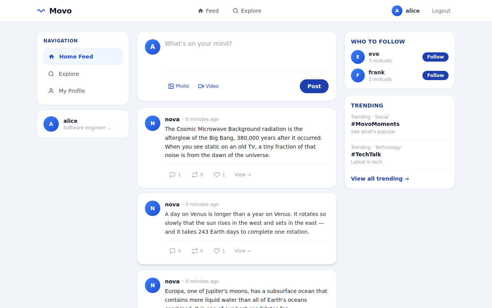
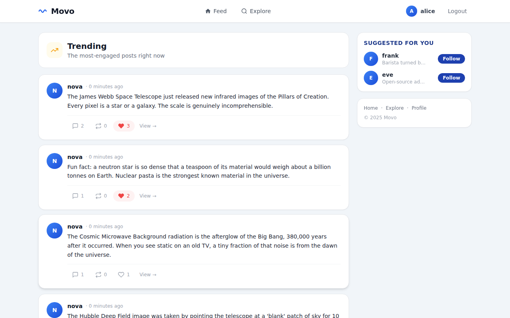
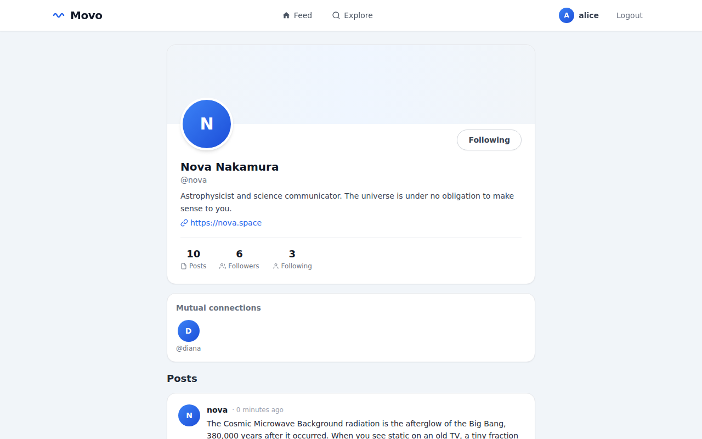

# Movo — Social Media Platform

Movo is a full-stack social media web application built with Django. It allows users to create accounts, publish posts, follow other users, like and comment on content, and discover trending posts. The project also serves as a practical demonstration of how core Data Structures and Algorithms (DSA) concepts can be applied in a real-world application.

---

## Features

- User registration, login, and profile management
- Create, delete, and view posts (text, images, and videos)
- Like, comment, and repost posts
- Follow and unfollow other users
- Personalised feed showing posts from followed users
- Trending Explore page powered by a custom Binary Max-Heap
- "Who to Follow" recommendations powered by BFS graph traversal
- Mutual follow display on user profile pages
- Persistent media storage via Cloudinary on Heroku

---

## Tech Stack

| Layer | Technology |
|---|---|
| Backend | Django 4.x (Python) |
| Database | PostgreSQL (Heroku) / SQLite (local) |
| Frontend | Tailwind CSS, Django Templates |
| Media Storage | Cloudinary (production) / local filesystem (development) |
| DSA | Pure Python (custom implementations) |
| Deployment | Heroku |

---

## Data Structures & Algorithms

### 1. Directed Graph + BFS (`dsa/graph.py`)
Models the social network where each user is a node and each follow relationship is a directed edge. BFS traversal is used to generate "Who to Follow" recommendations based on mutual connections.
- **Complexity:** O(V+E)

### 2. Binary Max-Heap (`dsa/heap.py`)
Ranks posts on the Explore page by a composite engagement score.
- **Score Formula:** `Likes + (Comments × 2) + Recency Bonus`
- **Complexity:** O(n log n) build, O(log n) insert

### 3. Hash Table (`dsa/hash_table.py`)
Enables O(1) lookup of whether the current user has liked or reposted a post. Uses polynomial rolling hash and separate chaining for collision resolution. Auto-resizes when load factor exceeds 0.75.
- **Complexity:** O(1) average lookup

---

## Project Structure

```
movo/
├── movo_project/     # Django project settings & URL routing
├── users/            # User model, authentication, profiles, follow system
├── posts/            # Posts, likes, comments, reposts
├── dsa/              # Custom DSA implementations
│   ├── graph.py      # Directed graph + BFS
│   ├── heap.py       # Binary max-heap
│   └── hash_table.py # Hash table with chaining
├── templates/        # Django HTML templates
├── static/           # CSS assets
└── media/            # User uploaded files (local dev only)
```

---

## Getting Started

### Prerequisites
- Python 3.10+
- pip

### Installation

```bash
git clone https://github.com/arpeli/movo_social.git
cd movo_social
pip install -r requirements.txt
python manage.py makemigrations users
python manage.py makemigrations posts
python manage.py migrate
python manage.py seed_data
python manage.py runserver
```

Open http://127.0.0.1:8000 and log in with any seed user and password `password123`.

**Seed users:** `alice`, `bob`, `charlie`, `diana`, `eve`, `frank`, `nova`

---

## Deployment (Heroku)

```bash
heroku create your-app-name
heroku addons:create heroku-postgresql:essential-0 --app your-app-name
heroku addons:create cloudinary:starter --app your-app-name
heroku config:set DJANGO_SECRET_KEY='your-secret-key' --app your-app-name
heroku config:set DEBUG=False --app your-app-name
heroku config:set ALLOWED_HOSTS='your-app-name.herokuapp.com' --app your-app-name
git push heroku main
```

---

## Screenshots

| Login | Feed |
|---|---|
|  |  |

| Explore | Profile |
|---|---|
|  |  |

---

## Authors

| Name | Role |
|---|---|
| Rose Mateta | Documentation |

---

## References

- Jain, H. (2021). *Problem Solving in Data Structures and Algorithms Using Python*. Chapter 23 — System Design.
- Django Software Foundation. *Django Documentation*. https://docs.djangoproject.com
